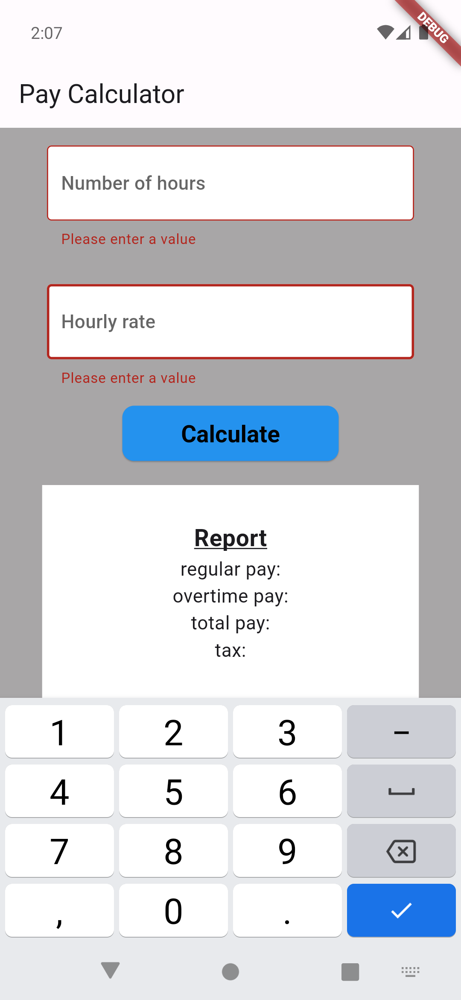

# Flutter-Pay-Calculator
Flutter Pay Calculator

### Formula:
- if no of hours is less or equal than 40 -> **total pay = no_of_hours * hourly_rate**
- else -> **total pay = (no_of_hours-40) * hourly_rate * 1.5 + 40 * hourly_rate**
- **tax = pay * 0.18**

### SCREENSHOTS:
<kbd></kbd>    <kbd></kbd>    <kbd></kbd>
